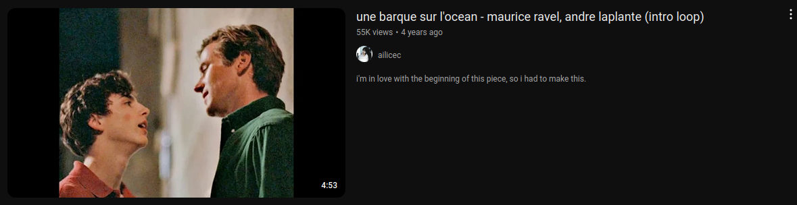

# YouTube-Music-Emotion-Detector
A Python project leveraging Librosa and other libraries to analyze the emotional tone of a given audio file (e.g., an .mp3) by employing the Krumhansl-Schmuckler key-finding algorithm.

# Analytical Tools
Let us start by analyzing a segment of 'Une Barque sur l'Ocean,' an intricate solo piano composition by the French composer Maurice Ravel. Click the image below to access it on YouTube:
[](https://www.youtube.com/watch?v=JdDySf4agqQ)

This composition features multiple sections in varying keys, which we can observe by loading the piece using the Librosa library and passing it to a Tonal_Fragment instance. Below, we perform this analysis and generate a chromagram, a chart that visualizes the intensity of each pitch class (C, C#, D, D#, etc.) over time.

```python
audio_path = 'une-barque-sur-l\'ocean.mp3'
y, sr = librosa.load(audio_path)
y_harmonic, y_percussive = librosa.effects.hpss(y)

unebarque = Tonal_Fragment(y_harmonic, sr)
unebarque.chromagram("Une Barque sur l\'Ocean")
```
