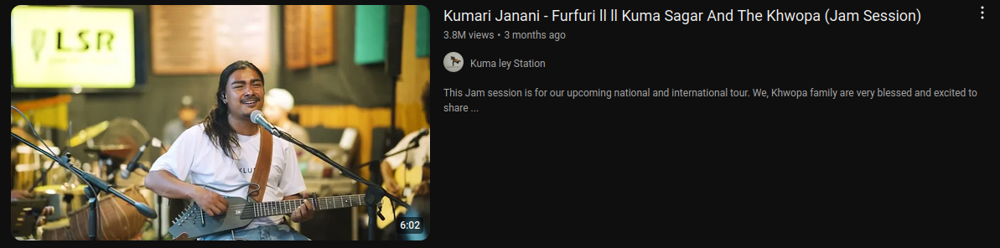
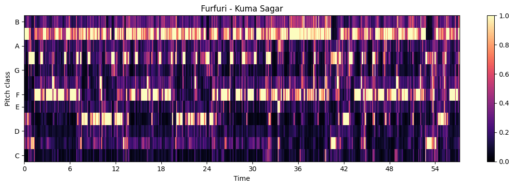

# YouTube-Music-Emotion-Detector
A Python project leveraging Librosa and other libraries to analyze the emotional tone of a given audio file (e.g., an .mp3) by employing the Krumhansl-Schmuckler key-finding algorithm.

# Analytical Tools
Let us begin by analyzing a segment of the song 'Furfuri,' sung by [Kuma Sagar](https://www.google.com/search?q=Kuma+sagar&client=ubuntu&hs=HRz&sca_esv=5a31cca9ef420a11&channel=fs&ei=jou8Z6OpDY_c2roPw8CNoQU&ved=0ahUKEwijqMvDy9yLAxUPrlYBHUNgI1QQ4dUDCA8&uact=5&oq=Kuma+sagar&gs_lp=Egxnd3Mtd2l6LXNlcnAiCkt1bWEgc2FnYXIyBxAAGIAEGBMyBxAAGIAEGBMyBxAAGIAEGBMyBxAAGIAEGBMyBxAAGIAEGBMyBxAAGIAEGBMyBxAAGIAEGBMyBxAAGIAEGBMyBxAAGIAEGBMyBxAAGIAEGBNIzB1Q6QhYhxtwAXgBkAEAmAHnAaAB7w-qAQUwLjUuNbgBA8gBAPgBAZgCCqACthGoAgDCAg4QABiABBixAxiDARiKBcICCxAAGIAEGLEDGIMBwgILEAAYgAQYsQMYigXCAggQABiABBixA8ICChAAGIAEGEMYigXCAgUQABiABJgDBvEFH18sTtkJ8c6SBwQyLTEwoAeJHw&sclient=gws-wiz-serp). Click the image below to access it on YouTube:
[](https://youtu.be/sCQDGs7W6mE?si=pT1_AbXhBbzEEgpt)

This composition features multiple sections in varying keys, which we can observe by loading the piece using the Librosa library and passing it to a Tonal_Fragment instance. Below, we perform this analysis and generate a chromagram, a chart that visualizes the intensity of each pitch class (C, C#, D, D#, etc.) over time.

```python
audio_path = 'furfuri-kuma-sagar.mp3'
y, sr = librosa.load(audio_path)
y_harmonic, y_percussive = librosa.effects.hpss(y)

furfuri = Tonal_Fragment(y_harmonic, sr)
furfuri.chromagram("furfuri-kuma-sagar")
```
[](https://github.com/Youbraj/YouTube-Music-Emotion-Detector/blob/main/furfuri_chromagram.png)
It is clear that the clip consists of distinct sections, each highlighting different pitch classes. For instance, in the segment from t=0 sec to t=22 sec, the pitches C# and F# dominate. To quantify the usage of each pitch class in this section, we can apply the following code:

```python
furfuri_fsharp_min = Tonal_Fragment(y_harmonic, sr, tend=22)
furfuri_fsharp_min.print_chroma()
```
```python
C 	 0.127
C# 	 0.330
D 	 0.211
D# 	 0.485
E 	 0.236
F 	 0.672
F# 	 0.312
G 	 0.227
G# 	 0.515
A 	 0.311
A# 	 1.000
B 	 0.363
```
A# appears to be the most frequently used pitch, followed by F. To identify the key of the section from t=0 sec to t=22 sec, we can use the following code:
```python
furfuri_fsharp_maj = Tonal_Fragment(y_harmonic, sr, tend=22)
furfuri_fsharp_maj.print_key()
```
```
>> likely key: F# minor, correlation: 0.762
```
The key of the song is identified using the Krumhansl-Schmuckler key-finding algorithm. This algorithm compares the prominence of each pitch class in the sample to typical profiles of both major and minor keys, selecting the key with the highest correlation coefficient. In this case, the algorithm correctly identifies A# minor as the key, even though F is not the most prominent pitch in this section. Unlike many other algorithms, which assume that the most prominent pitch is the 'tonic' or root of the key, this algorithm avoids such assumptions, making it more robust. Additionally, the correlation coefficients of the chroma data can be printed for further analysis:
```python
furfuri_fsharp_min.corr_table()
```
```
C major 	 -0.519
C# major 	  0.339
D major 	 -0.485
D# major 	  0.503
E major 	 -0.211
F major 	  0.185
F# major 	  0.279
G major 	 -0.621
G# major 	  0.273
A major 	 -0.401
A# major 	  0.665
B major 	 -0.007
C minor 	 -0.153
C# minor 	 -0.224
D minor 	  0.044
D# minor 	  0.465
E minor 	 -0.564
F minor 	  0.314
F# minor 	 -0.268
G minor 	  0.175
G# minor 	  0.202
A minor 	 -0.403
A# minor 	  0.739
B minor 	 -0.326
```
This highlights A# minor as a strong second-best option and facilitates a comparison of the goodness of fit across all keys.

This algorithm offers high accuracy in its results, as demonstrated in the next section of the 'Furfuri' clip, from t=22 sec to t=33 sec, which is also in A# minor:
```python
furfuri_e_min = Tonal_Fragment(y_harmonic, sr, tstart=22, tend=33)
furfuri_e_min.print_key()
```
```
likely key: A# minor, correlation: 0.7
```
Other sound clips can also be analyzed, with two additional examples provided in the Jupyter notebook [musicemotiondetector.ipynb](www.google.com) within this repository. The Tonal_Fragment class is saved in the [emotiondetector.py](www.google.com) file. Note that analyzing .mp3 files requires FFMpeg to be installed, while .wav and other file formats can be processed by Librosa without it. For the most accurate analyses, it's recommended to separate the harmonic and percussive components of the sample and use sound samples that are at least 10 seconds long.
